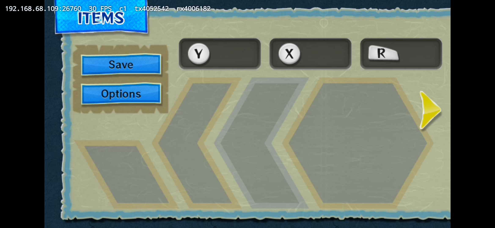

# Wind Waker HD color verification

Date: 2026-09-12

## Context

First in-game validation of the `VK_FORMAT_A2B10G10R10_UNORM_PACK32`
(format 64) unpacking path, deployed in the RelWithDebInfo fork build.
Previously Wind Waker produced no video at all
(`StreamingCapture: Unsupported DRC Vulkan format 64`).

## Evidence

Phone frame (binary-safe `screencap` + `pull`; earlier `exec-out` redirect
captures were byte-mangled by PowerShell): inventory screen streaming at
30 FPS, client c1, counters flowing.

## Verdict: channel order correct

- White ITEMS/Save/Options text is white (R=G=B intact).
- Blue banner, buttons, and torn border are blue (B dominant, R low).
- Parchment background is tan (R high, B low).
- Selector arrow is yellow (R+G, B low).
- Empty slots grey-green, outer background navy.

An R<->B swap would turn the blues orange, the parchment blue, and the
yellow cursor blue. None of that is present. Title screen (white/gold on
black) corroborates. No format errors in the Cemu log; client connected
and IDR clean.

## Limitations

- No same-moment desktop DRC capture (Cemu window occluded behind
  VS Code/browser; foreground steal did not take). Judgment is against
  the known Wind Waker palette, which is decisive for gross channel
  errors but not for subtle range/BT.601-vs-709 differences.
- Hyrule Warriors verification still open (needs a game session).
