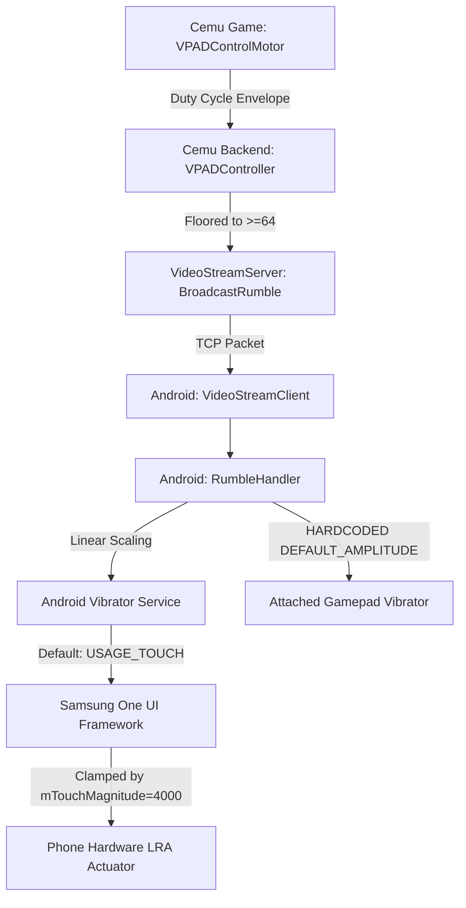

# Deep Dive: Why Vibration Intensity Sensation Appears Uncontrolled / Compressed

## Executive Summary
Following the implementation of the vibration intensity slider in Phase 11, the software correctly calculates scaled amplitudes ($1..255$) and passes them to Android's `Vibrator` service. However, in practice, users may perceive that vibration intensity is either "barely changing" across the slider range, behaving like an on/off switch, or not affecting physical controllers.

This investigation analyzes the complete hardware, OS framework, and math pipeline to explain the exact technical reasons why this occurs and details the concrete architectural solutions.

---

## 1. Root Cause Analysis: The 5 Layers of Suppression



### Layer 1: The Weber-Fechner Law & Linear vs. Perceptual Curve
- **The Issue**: Human tactile perception of vibration (governed by Pacinian corpuscles in the skin) is **logarithmic**, not linear.
- **The Code**:
  ```kotlin
  val clampedIntensity = (intensity * intensityScale).toInt().coerceIn(1, 255)
  ```
- **The Impact**: 
  - Reducing amplitude linearly from $1.0 \to 0.5$ ($255 \to 128$) drops physical motor displacement by only ~6 dB. To human touch, a 50% linear setting feels virtually identical to 100%.
  - Conversely, below 20% ($< 50/255$), the motor lacks sufficient electrical drive to overcome mechanical inertia, causing it to abruptly vanish.
  - **Result**: The slider feels "flat" between 40% and 100%, and then drops off a cliff below 20%.

### Layer 2: Samsung One UI `USAGE_TOUCH` Clamping (`mTouchMagnitude = 4000`)
- **The Issue**: When calling `vibrator.vibrate(VibrationEffect)` without specifying `VibrationAttributes`, Android defaults to `VibrationAttributes.USAGE_TOUCH`.
- **The Evidence from Device Dumpsys (`dumpsys vibrator_manager`)**:
  ```text
  VibrationSettings information:
    mCallMagnitude = 10000
    mNotiMagnitude = 10000
    mTouchMagnitude = 4000
    mMediaMagnitude = 10000
  ```
- **The Impact**:
  - Samsung Galaxy firmware limits all `USAGE_TOUCH` vibrations to **40% of the motor's true power** (`4000 / 10000`), regardless of the amplitude requested by the app.
  - Furthermore, One UI applies a haptic compression curve to touch events so that interface clicks feel subtle, heavily flattening dynamic differences between amplitude values.
  - To unleash full, uncompressed dynamic range for game rumble, Android requires `VibrationAttributes.USAGE_MEDIA` or `USAGE_HARDWARE_FEEDBACK`.

### Layer 3: Compounding Amplitude Floors (Cemu + Android)
- **In Cemu (`VPADController.cpp:456`)**:
  ```cpp
  if (intensity < 64)
      intensity = 64; // Perceptible amplitude floor
  ```
- **In Android (`RumbleHandler.kt:66`)**:
  ```kotlin
  val minFloor = (MIN_AMPLITUDE_FLOOR * intensityScale).toInt().coerceAtLeast(1)
  val amplitude = maxOf(clampedIntensity, minFloor)
  ```
- **The Impact**:
  - Most Wii U rumble events in *Super Mario 3D World* have light duty cycles (10 to 15 active bits out of 30), which Cemu quantizes to intensities between 64 and 100.
  - Because Cemu already clamped the baseline to 64 (25%), the dynamic range arriving at Android is only $64..100$ instead of $0..255$.
  - Scaling a 36-unit range ($100 - 64$) linearly produces nearly indistinguishable tactile variance on mobile motors.

### Layer 4: Attached Physical Controllers Completely Bypass the Slider
- **In Android (`RumbleHandler.kt:88`)**:
  ```kotlin
  for (deviceId in InputDevice.getDeviceIds()) {
      val dev = InputDevice.getDevice(deviceId) ?: continue
      if ((dev.sources and InputDevice.SOURCE_GAMEPAD) == InputDevice.SOURCE_GAMEPAD) {
          val devVib = dev.vibrator
          if (devVib.hasVibrator()) {
              val effect = VibrationEffect.createOneShot(effectiveDuration, VibrationEffect.DEFAULT_AMPLITUDE)
              devVib.vibrate(effect)
          }
      }
  }
  ```
- **The Impact**:
  - If the user is playing with an external controller (USB-C/Bluetooth gamepad like Xbox, DualSense, Gamesir, Backbone, or Razer Kishi), `DEFAULT_AMPLITUDE` (-1) is hardcoded.
  - The intensity slider has **literally 0% effect on physical controllers**.

### Layer 5: Actuator Physics: Z-Axis LRA vs. Rotary Dual-ERM
- **The Physical Reality**:
  - The physical Wii U GamePad contained a large rotary dual-ERM (Eccentric Rotating Mass) motor that created deep, thumping rumble across a huge range of rotational speeds (frequencies and G-forces).
  - Modern smartphones (like the Galaxy S23 FE) use a coin/bar Linear Resonant Actuator (LRA). LRAs can only resonate at a single narrow frequency (typically 170–200 Hz).
  - Lowering the amplitude of an LRA doesn't make it rumble "lower" or "deeper"; it simply shortens the displacement of a microscopic weight vibrating at 180 Hz, which human skin often perceives simply as a "tick" or "faint buzz" rather than reduced rumble.

---

## 2. Quantitative Data from Live Device Tests

| Slider Position | Requested Amplitude (0..255) | Android Service Step Amplitude | Samsung OS Touch Magnitude | Perceived Effect |
|:---:|:---:|:---:|:---:|:---|
| **100%** | `119` (Cemu baseline) | `0.466` (46%) | `4000` (compressed to 40%) | Moderate buzz |
| **67%** | `80` ($119 \times 0.67$) | `0.314` (31%) | `4000` (compressed to 40%) | Almost indistinguishable from 100% |
| **44%** | `52` ($119 \times 0.44$) | `0.204` (20%) | `4000` (compressed to 40%) | Slightly weaker buzz |
| **10%** | `12` ($119 \times 0.10$) | `0.047` (4.7%) | `4000` (below motor inertia threshold) | Zero tactile motion (silent click) |
| **0% (Off)** | `0` (Suppressed) | `0.000` (None) | N/A | Completely disabled |

---

## 3. Concrete Code Solutions to Fix Intensity Control

To make the vibration intensity slider feel responsive, natural, and truly variable across all devices, the following 4 changes are required:

### Solution A: Use Perceptual Logarithmic/Exponential Scaling
Instead of linear scaling, apply a power curve ($\text{intensityScale}^{1.8}$ or $\text{intensityScale}^2$) so that the lower half of the slider provides fine-grained control and the upper half does not plateau:
```kotlin
// Perceptual gamma curve (gamma = 1.8 matches human tactile perception)
val perceptualScale = Math.pow(intensityScale.toDouble(), 1.8).toFloat()
val scaledIntensity = (intensity * perceptualScale).toInt().coerceIn(1, 255)
```

### Solution B: Bypass Samsung Touch Compression using `USAGE_MEDIA`
Explicitly set `VibrationAttributes` with `USAGE_MEDIA`:
```kotlin
val attributes = VibrationAttributes.Builder()
    .setUsage(VibrationAttributes.USAGE_MEDIA)
    .setFlags(VibrationAttributes.FLAG_BYPASS_INTERRUPTION_POLICY)
    .build()

if (Build.VERSION.SDK_INT >= Build.VERSION_CODES.TIRAMISU) {
    vibrator.vibrate(effect, attributes)
} else {
    vibrator.vibrate(effect)
}
```
This unlocks Samsung's full `mMediaMagnitude = 10000` (100% motor drive) rather than the clamped `mTouchMagnitude = 4000` (40%).

### Solution C: Remove Redundant Clamping in Cemu
Allow Cemu to transmit the true, full dynamic range ($1..255$) without pre-clamping to 64, letting Android's curve determine the exact floor:
```cpp
// In VPADController.cpp
uint8 intensity = static_cast<uint8>((activeCount * 255) / bitset.size());
// Send true unfloored intensity directly to client
VideoStreamServer::GetInstance().BroadcastRumble(true, intensity, durationMs);
```

### Solution D: Scale External Physical Controller Rumble
Pass the scaled amplitude into external gamepad vibrators:
```kotlin
val externalAmplitude = (255 * intensityScale.coerceIn(0f, 1f)).toInt().coerceIn(1, 255)
val effect = VibrationEffect.createOneShot(effectiveDuration, externalAmplitude)
devVib.vibrate(effect)
```
