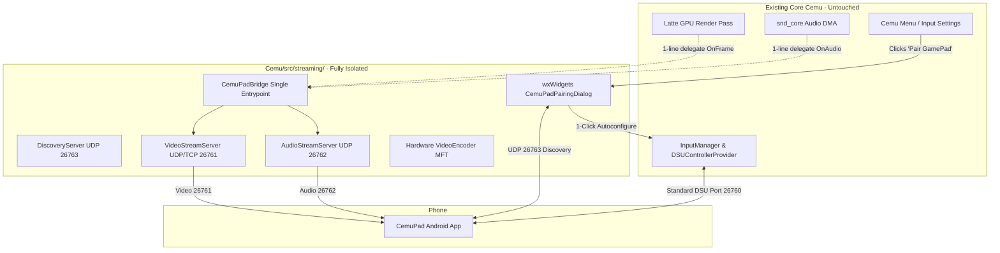

# Architectural Plan — Modular CemuPad Streaming Subsystem & 1-Click Auto-Configuration

## 1. Executive Summary & Design Principles

### The Problem
During rapid prototyping, features like video encoding, audio routing, rumble translation, and network transport were integrated directly across various core Cemu subsystems (`Latte/Renderer`, `input/emulated`, `Cafe/OS/libs/snd_core`, `Cafe/OS/libs/vpad`). 
While functional, this approach:
1. Creates wide git diffs across core Cemu files, creating merge conflicts with upstream Cemu developments.
2. Requires manual configuration in Cemu's Input Settings (creating a DSU Client controller, manually typing the phone's IP `192.168.x.x:26760`, and selecting Wii U GamePad).

### The Solution: Modular Isolation & 1-Click Pairing
1. **Isolated Subsystem (`Cemu/src/streaming/`)**:
   - Consolidate all streaming servers, encoders, UDP discovery, and protocol handling into a single dedicated module directory: `Cemu/src/streaming/`.
   - Core Cemu files only interact with the module via a thin, non-invasive observer interface (`CemuPadBridge`), leaving core emulation pipelines completely untouched when streaming is not active.
2. **Cemu UI: "Auto-Discover & Pair Android GamePad"**:
   - Add a native wxWidgets button in Cemu's Input Settings (`InputSettings2.cpp`) and menu bar (`Options > Connect Android GamePad...`).
   - Clicking the button opens a clean dialog that listens for broadcast beacons (`"CEMUPAD_DISCOVER"`) from Android phones on the local network.
3. **Automatic DSU Controller Configuration**:
   - When the user selects their discovered Android device and clicks **"Pair & Connect"**:
     - Cemu programmatically configures Controller 0 as an emulated **Wii U GamePad**.
     - Automatically attaches a **DSU Client** provider pointing to the discovered device's IP and port (`<Device_IP>:26760`).
     - Applies the default GamePad button/axis/touch mappings.
     - Immediately starts the video and audio streaming pipelines.
     - **Zero manual typing of IP addresses; zero editing of XML profiles.**

---

## 2. Architecture Diagram



---

## 3. Detailed Component Design

### A. Subsystem Directory Structure
All streaming logic is grouped into `Cemu/src/streaming/`:
```text
Cemu/src/streaming/
├── CemuPadBridge.h           // Thin public API exposed to Cemu
├── CemuPadBridge.cpp
├── CemuPadConfig.h           // Module settings & persistence
├── DiscoveryServer.h         // UDP 26763 discovery responder & scanner
├── DiscoveryServer.cpp
├── VideoStreamServer.h       // TCP 26761 control & UDP 26761 video
├── VideoStreamServer.cpp
├── VideoEncoder.h            // Hardware H.264 MFT encoder
├── VideoEncoder.cpp
├── AudioStreamServer.h       // UDP 26762 48 kHz stereo audio streamer
├── AudioStreamServer.cpp
└── ui/
    ├── CemuPadPairingDialog.h   // wxWidgets discovery & 1-click pair dialog
    └── CemuPadPairingDialog.cpp
```

### B. Thin Core Integration Hook (`CemuPadBridge.h`)
Instead of inserting dozens of lines into `Latte`, `snd_core`, and `vpad`, core Cemu only includes `streaming/CemuPadBridge.h`:
```cpp
#pragma once
#include <cstdint>
#include <cstddef>

class CemuPadBridge
{
public:
    static CemuPadBridge& GetInstance();

    // Lifecycle
    void Initialize();
    void Shutdown();
    bool IsActive() const;

    // Lightweight non-invasive delegates (no-op when IsActive() == false)
    void OnGamepadFrame(const uint8_t* rgbaPixels, uint32_t width, uint32_t height);
    void OnAudioSamples(const int16_t* pcmStereo, size_t sampleCount);
    void OnRumble(uint8_t channel, const uint8_t* pattern, uint8_t length);

    // Controller auto-configuration
    bool AutoConfigureDSUController(const std::string& deviceIp, uint16_t dsuPort = 26760);
};
```

### C. 1-Click Programmatic DSU Controller Configuration
When a device is selected in the discovery dialog, `CemuPadBridge::AutoConfigureDSUController` invokes Cemu's standard input subsystem:
```cpp
bool CemuPadBridge::AutoConfigureDSUController(const std::string& deviceIp, uint16_t dsuPort)
{
    auto& inputMgr = InputManager::instance();
    auto vpad = inputMgr.get_vpad_controller(0);
    if (!vpad)
    {
        cemuLog_log(LogType::Force, "CemuPadBridge: Failed to acquire VPAD controller 0");
        return false;
    }

    // Format DSU UUID string expected by Cemu (IP:Port)
    std::string uuid = fmt::format("{}:{}", deviceIp, dsuPort);
    std::string displayName = fmt::format("CemuPad ({})", deviceIp);

    try
    {
        // 1. Instantiate official DSUClient controller using Cemu's ControllerFactory
        auto controller = ControllerFactory::CreateController(
            InputAPI::DSUClient,
            uuid,
            displayName.c_str()
        );

        if (!controller)
        {
            cemuLog_log(LogType::Force, "CemuPadBridge: ControllerFactory returned null for DSUClient");
            return false;
        }

        // 2. Clear existing bindings and assign DSU controller to VPAD (Wii U GamePad)
        vpad->clear_controllers();
        vpad->add_controller(controller);

        // 3. Apply Cemu's standard default mapping for Wii U GamePad
        vpad->set_default_mapping(controller);

        // 4. Save to controller0.xml so it persists across restarts
        inputMgr.save_controller_profile(0);

        cemuLog_log(LogType::Force, "CemuPadBridge: Successfully configured Controller 0 as Wii U GamePad with DSU {}", uuid);
        return true;
    }
    catch (const std::exception& ex)
    {
        cemuLog_log(LogType::Force, "CemuPadBridge: Error configuring DSU controller: {}", ex.what());
        return false;
    }
}
```

### D. wxWidgets CemuPad Pairing Dialog (`CemuPadPairingDialog.cpp`)
The UI presented to the user inside Cemu:
```cpp
// Sizer Layout:
// +---------------------------------------------------------+
// |  CemuPad - Connect Android GamePad                      |
// +---------------------------------------------------------+
// |  Discovered Devices on Local Network:                  |
// |  [ Galaxy S23 FE (192.168.68.114) - Ready ]   [Rescan]  |
// |                                                         |
// |  Status: CemuPad app detected on port 26763             |
// |                                                         |
// |  [X] Automatically configure as Wii U GamePad (Slot 0)  |
// |  [X] Start Video (854x480) & Audio Stream immediately    |
// |                                                         |
// |                    [ Pair & Connect ]   [ Cancel ]      |
// +---------------------------------------------------------+
```

When **Pair & Connect** is clicked:
1. Calls `CemuPadBridge::GetInstance().AutoConfigureDSUController(selectedIp, 26760)`.
2. Starts video & audio streaming targeting `selectedIp`.
3. Displays a success notification: *"Connected to CemuPad! GamePad is ready to play."*

---

## 4. Migration Plan for Autonomous Execution

### Step 1: Create the Isolated Directory Structure
Create `Cemu/src/streaming/` and move existing video encoder, video server, audio server, and discovery files into it.

### Step 2: Implement `CemuPadBridge`
Wire `CemuPadBridge` as the single point of contact between Cemu and the streaming subsystem.

### Step 3: Implement `CemuPadPairingDialog`
Implement the native wxWidgets dialog and bind it to:
1. `InputSettings2.cpp`: Add an **"Auto-Discover CemuPad"** button next to the existing "Add" button.
2. Main Menu: Add **"Connect Android GamePad..."** under the **Options** menu.

### Step 4: Clean Up Core Files
Revert invasive modifications in:
- `vpad.cpp`: Forward rumble calls to `CemuPadBridge::GetInstance().OnRumble(...)`.
- `snd_core.cpp`: Forward audio DMA samples to `CemuPadBridge::GetInstance().OnAudioSamples(...)`.
- `Latte/Renderer`: Replace direct encoder hooks with `CemuPadBridge::GetInstance().OnGamepadFrame(...)`.

---

## 5. Benefits for Upstream PR & Upstream Developers

1. **Zero Upstream Conflict**: Core files only contain 1-line delegate hooks guarded by `#ifdef ENABLE_CEMUPAD`. If disabled, Cemu builds 100% identically to stock Cemu.
2. **User Friendly**: Users no longer need to look up their phone's IP address in Android Wi-Fi settings, navigate Cemu's complex controller tabs, create DSU client entries, or map buttons manually.
3. **Architectural Purity**: Leverages Cemu's existing `DSUControllerProvider` and `ControllerFactory` exactly as intended by Cemu's original authors.
